# 🐧 Lab 1 – Investigate Kali Linux

## 📖 Overview

This lab introduced the Kali Linux operating system and its role in cybersecurity. The exercise focused on exploring the Linux desktop environment, understanding the file system, and becoming familiar with essential command-line operations required for future cybersecurity tasks.

---

## 🎯 Objectives

- Explore the Kali Linux environment.
- Understand the Linux directory structure.
- Practice basic terminal commands.
- Learn file and directory navigation.
- Gain confidence using the Linux command line.

---

## 🛠️ Environment

| Item | Details |
|------|----------|
| Operating System | Kali Linux |
| Platform | Virtual Machine |
| Tools | Linux Terminal |

---

## 📋 Activities Performed

- Booted the Kali Linux operating system.
- Explored the desktop environment.
- Navigated system directories.
- Executed basic Linux commands.
- Examined system information.

---

## 💻 Commands Used

```bash
pwd
ls
ls -la
cd
mkdir
rmdir
touch
cp
mv
rm
clear
whoami
hostname
ifconfig
ip a
```

---


## 📸 Lab Screenshots

### 1. Lab Title

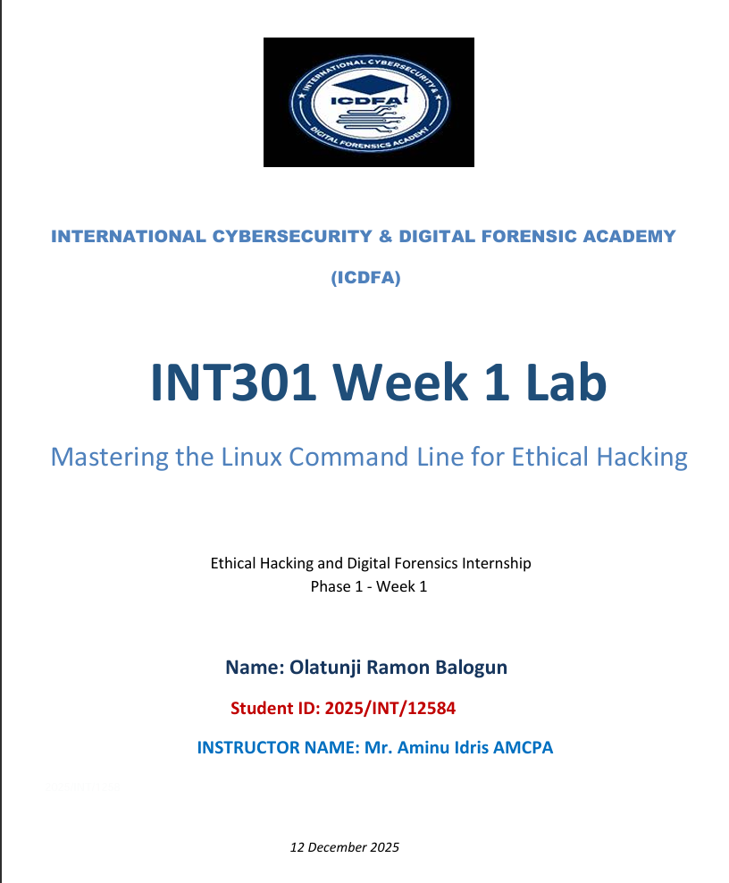

---

### 2. Lab Objectives

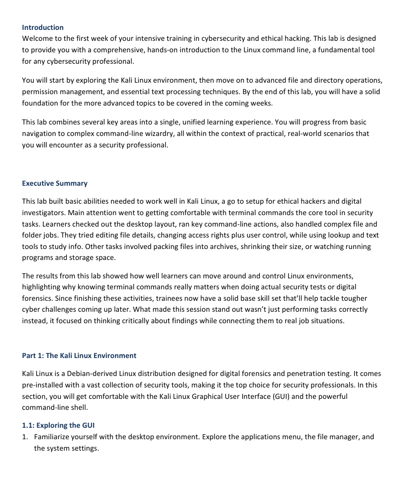

---

### 3. Kali Linux Terminal

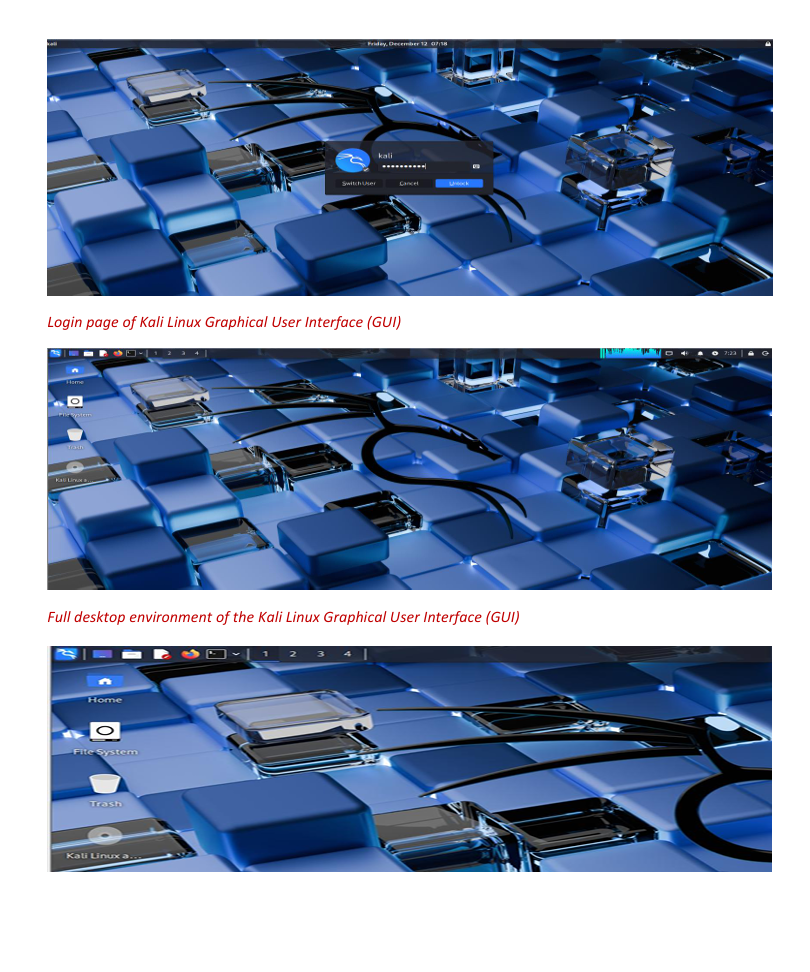

---

### 4. Kali Linux Browser

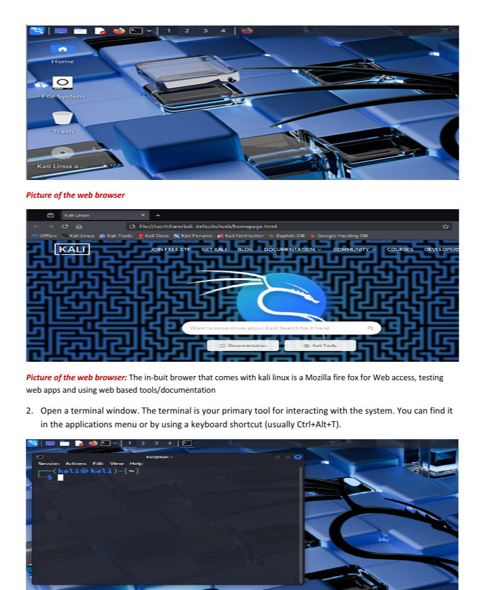


---

### 5. Linux Commands

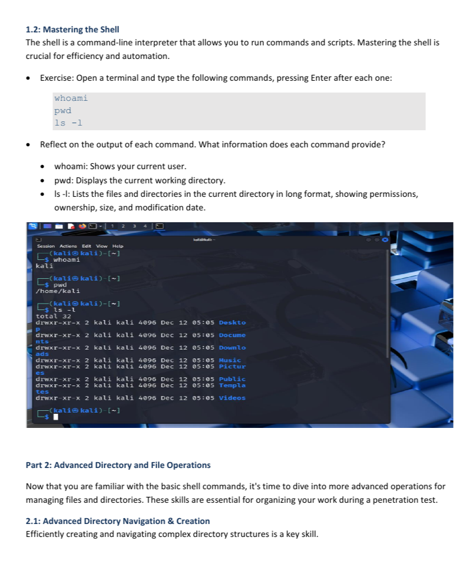

---

### 6. Navigate to Home Directory

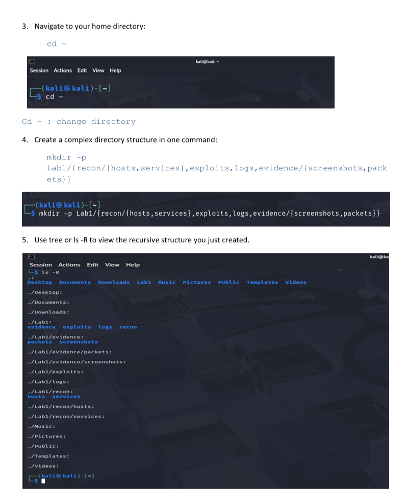

---

### 7. Comprehensive File Operations

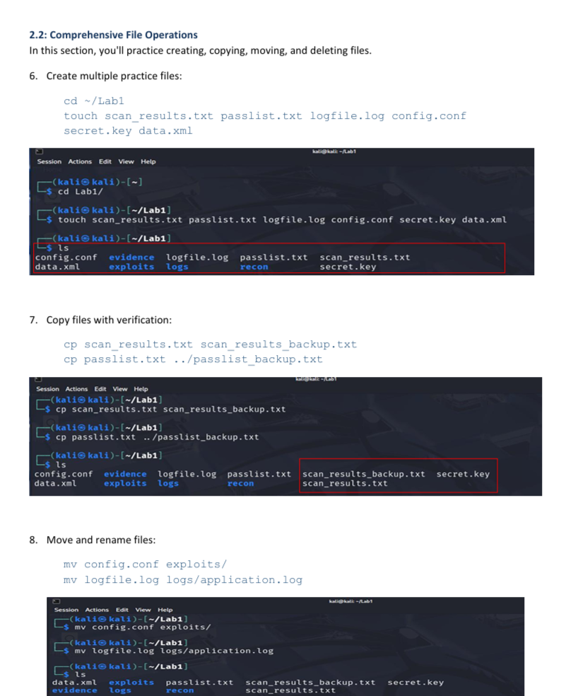

---

### 8. Creating & Viewing File Content

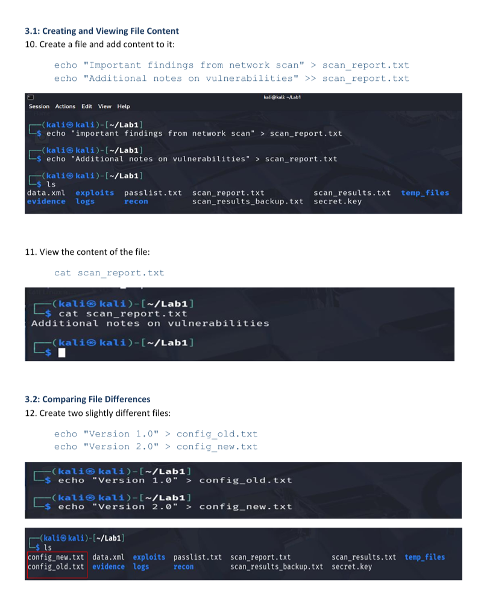

---

### 9. Modify File Permissions

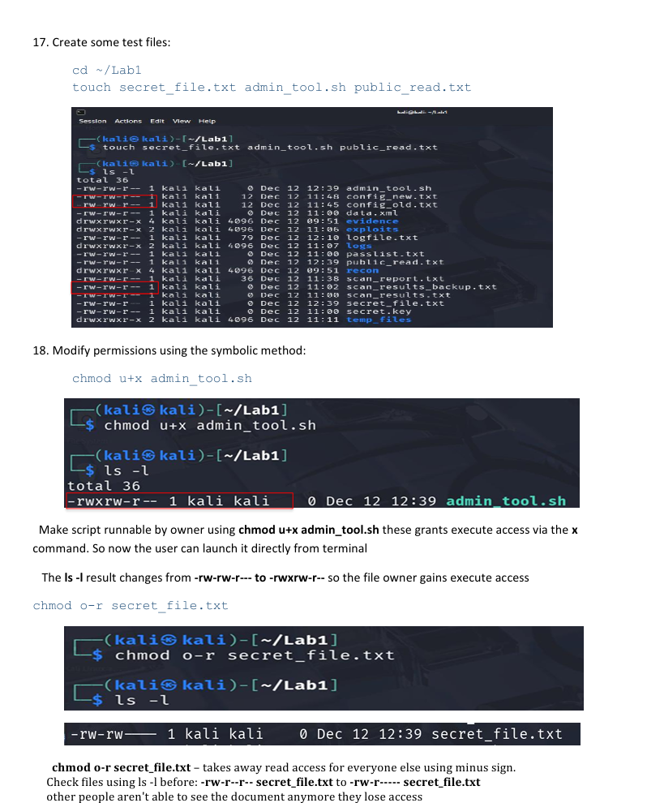

---

### 10. Finding Files

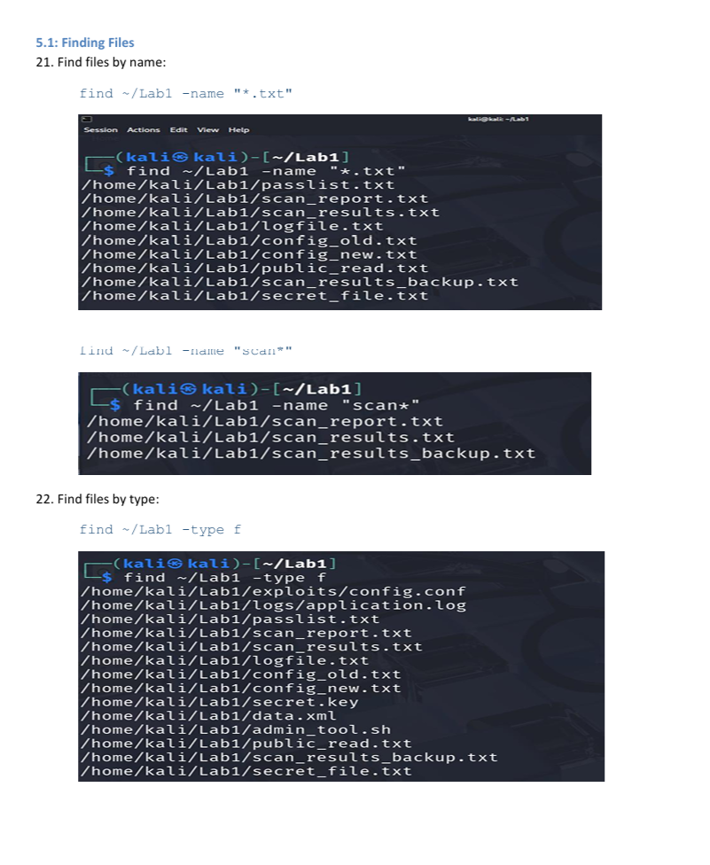

---

### 11. Sorting and Uniquing

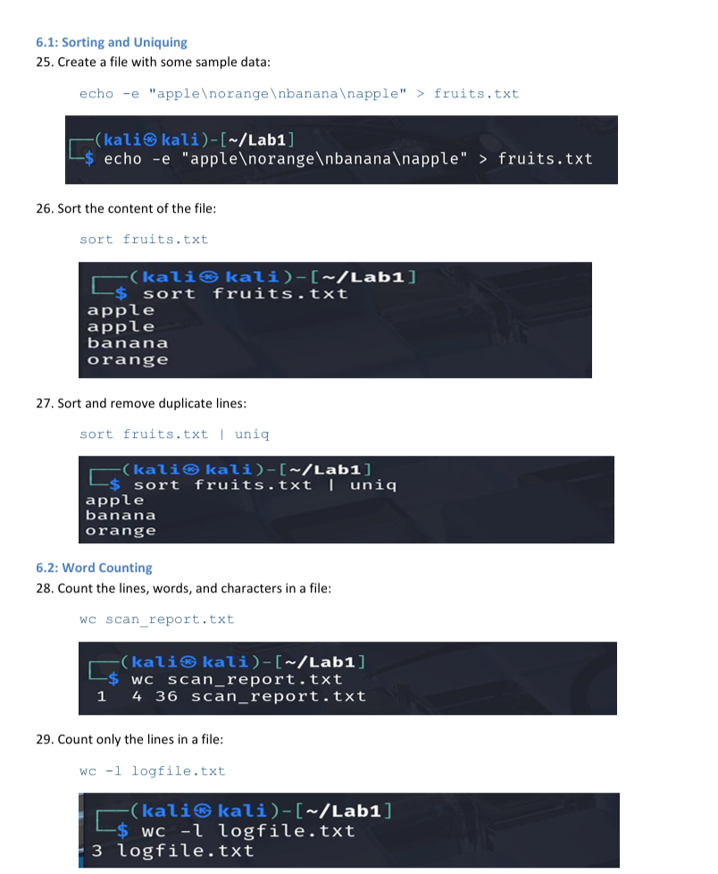

---

### 12. System Monitoring Processes

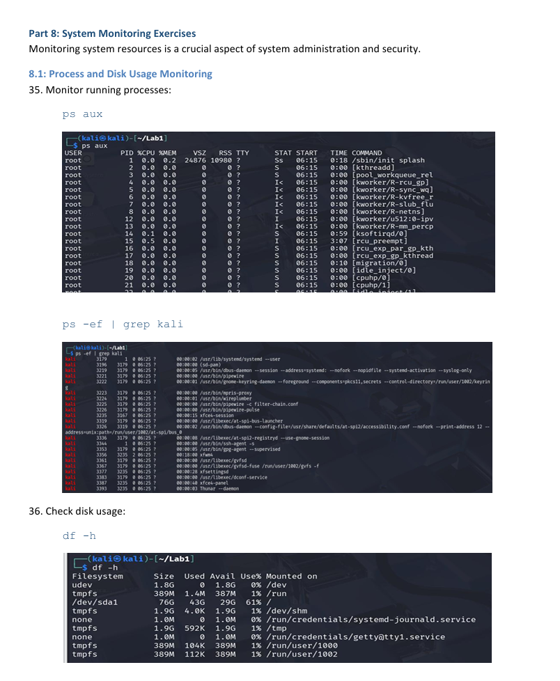

---

## 🎯 Skills Acquired

- Linux Navigation
- Command Line Interface (CLI)
- File Management
- Directory Structure
- Basic Linux Administration

---

## 📚 Key Takeaways

This lab provided the foundation required to work comfortably within Linux environments, which is an essential skill for penetration testing, system administration, and cybersecurity operations.

---

## ✅ Status

**Completed**
